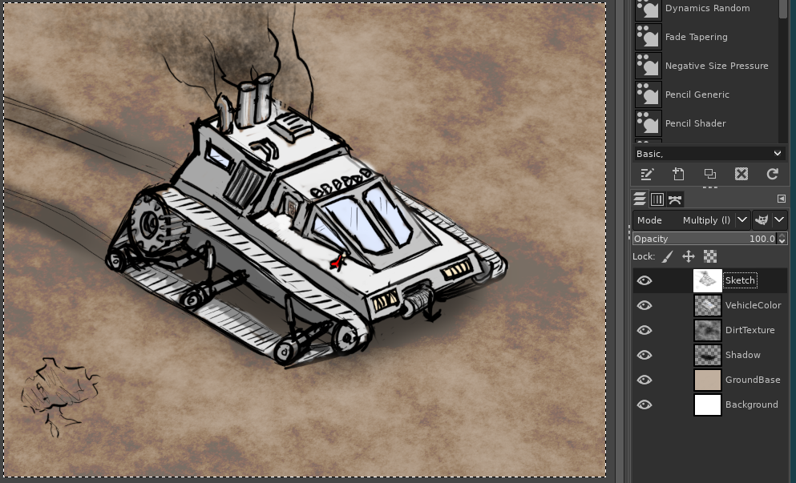

# Sverg

In the beginning, computers drew lines using electron beams on 
phosphorescent surfaces. This is a form of vector graphics. Then 
screens turned into pixel-based affairs and vector graphics took a bit 
of a back seat, with hundreds of raster graphics formats being 
developed. In the year 2001, SVG was released to create a standardized 
format for vector data.

Sverg is an hybrid vector-raster file format. In fact, that's 
what it's name is:

> Scalable Vector Editable Raster Graphics

And besides, the name just sounds cool (and means "to take an oath" to 
Norwegian)

So what is sverg? Sverg defines an image as a composite of stamped 
images. Consider a simple image:

What happens if we put lots of them close together:

You can create a picture that contains something normally hard to 
represent in vector graphics: textures. And in theory, because this is 
"just" a bunch of clones of the same image, we can store where each 
stamp is and edit it later. We can change the resolution or aspect 
ratio of the canvas it was drawn on, and a million other things 
normally associated with vector graphics.

## Why Now
SVG was created in ~2001, At this point computers didn't have dedicated 
graphics cards, and as a result stamping thousands of images around was 
not feasible. Any modern computer system (including laptops and phones) 
have a GPU that is roughly the same level of processing power as it's 
CPU, but are optimized for ... drawing graphics. We now have enough
oomph to push around thousands of small images without risking our 
computers overheating or having to wait for it to render. You may 
notice that splatting lots of images around is exactly what computer 
games do in particle systems for creating effects like smoke and fire. 
Yup, we're doing the same thing here on a 2D canvas - based on the input 
of the user rather than a simulation.

## Breaking down an image

### Operations
When a person draws or alters a canvas they are performing an operation.
Operations can be things like:

 - Drawing with a brush
 - Performing a bucket fill
 - Smudging

Operations also include slightly more obscure things such as
 - Blurring a layer
 - Color adjusting a layer
 - Overlaying one layer onto another
 
Operations can have more than one input: blending two layers together 
can be combined according to a third (eg a layer mask), or a blur 
radius could be non-uniform. 
 
*An operation is anything that takes in the image in one state
and does something to transform it into a new state*

### DepGraph
If you've worked with image manipulation software before, you've probably
come across the concept of layers. Layers allow a user to operate on a
subset of the drawing, and these layers can be combined in interesting
ways. In this image you can see that layers allow editing the vehicle 
separately from the background, and if you look closely you can see 
that the sketch is a black-and-white image combined using the multiply 
blend mode.

In reality layers are a simplified form of a dependency graph:

Constructs like layer groups are an attempt to expand the concept of layers
into that of a full graph system, so let's just start with a full digraph
as our "layer" system.

Is it worth using a digraph rather than a layers-tree-structure? I think so.
There are cases when I've been making images where I've wanted to apply
different effects to the same layer and combine them again. This is not
possible with a linear layer system.
Of course, a normal layers/layer-group workflow can be presented to the
user based on the user interface design.

*The depgraph describes how operations are chained in order to create a final
image.*

## Designing a file format

The requirements for the format are:

 - Extensible. Adding support for new features later should be possible.
    All the best formats (HTML, svg etc.) support this and in my
    experiments at making a sverg editor, this is really really useful.
 
 - Allow storing editor data in addition to the image data. Inkscape stores
    a bunch of parameters directly in the SVG file. This means that it doesn't need
    a special editor format. Since there are no editors for sverg (yet), it may make sense
    to support storing editor information. However, this should probably be done through 
    *extensions* rather than the base definition of the format.
    
 - Compact. We are going to be storing thousands of points. Putting XML tags around each of
    them would not be great for filesize! The format should ideally not be too much larger than
    the equivalent raster image - although if it is a complex image (lots of layers and effects)
    this will be unavoidable.
 
 - Easy to work with. A custom binary format would be very compact, but is also a pain to
    write parsers for and unless well designed, tend not to be very extensible. Using 
    well-defined formats (eg JSON, tar, png) we should be able to produce a format that
    is easy to work with. Similarly, the format should be sane for both humans and computers
    to work with.

# The Format

- [Sverg Version 0 (deprecated)](v0/sverg_v0.md)
- [Sverg Version 1](v1/sverg_v1.md)
