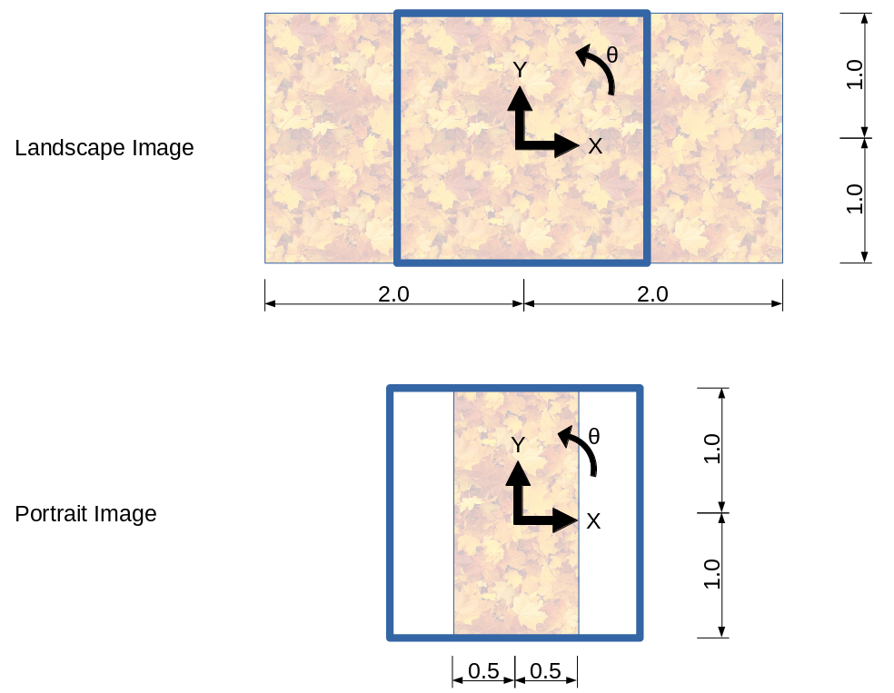
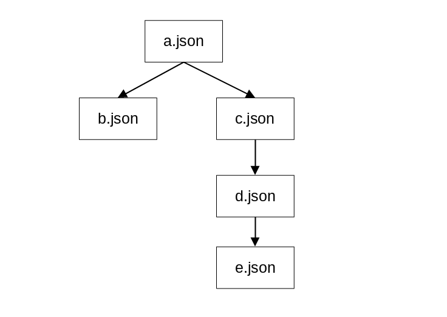

# Sverg V1

SvergV1 is a combination of standard formats. The main layer is
[JSONB](https://en.wikipedia.org/wiki/BSON)

BSON meets a nice line between standard, small data size without 
requiring compression, and the ability to store arbitrary binary data 
(unlike normal JSON which would have to include base64 strings)

# Representations
## Color
When stored in BSON, a color is always stored as a set of four doubles (f64) in
order `RGBA`. The values range from 0.0 to 1.0
```json
[0.0, 0.0, 0.0, 0.0]  <- Black, transparent
[0.0, 0.0, 0.0, 1.0]  <- Black, opaque
[1.0, 0.0, 0.0, 1.0]  <- Red, opaque
[0.0, 1.0, 0.0, 1.0]  <- Green, opaque
[0.0, 0.0, 1.0, 1.0]  <- Blue, opaque
```

## Positions
Because sverg is designed to be (mostly) resolution independent, the 
coordinate system should not depend on pixels. Instead, the coordinate
system always reaches from -1.0 to 1.0 according to the height of the image.
Angles are always represented with positive being anti-clockwise.

For example:


Thus a position is an array of two floats `[x,y]`


# Storage

The overal structure for the file is:
```json
{
    "file_version_number": 1,
    "metadata": {},
    "operations": {},
    "glyphs": {},
    "depgraph": []
}
```

Extra data is permitted to be stored in the file with the caveat that 
it MUST be prefixed by an underscore and a small piece of text 
describing what class of information it is. For example if I had an 
editing tool called "SuperPainter", I may create some extra entry in 
the root level of the BSON such as `_sp_undo_history` or 
`_sp_view_context`. Or if there is a standard extension to the language 
for handling interchange of brushes, perhaps it would create a key 
`_brushes`.

## File Version Number
The file version number for this format is ... `1`

## Metadata
Metadata describes the process of creating the file. It contains the fields
```json
"metadata": {
    "canvas_size": [x,y]
}
```
Color is represented as standard - as an array of doubles (f64).
Canvas size is two 64-bit integers. Both number should be positive.
The unit is pixels, and this is the _minimum_ acceptable resolution for 
rendering this image. If you can implement a renderer that allows 
infinite scaling of this file format, then go ahead and just use these 
numbers to inform the aspect ratio.

## The depsgraph
The depsgraph describes how operations relate to each other. It is stored
as a map of dependants:
```json

"depgraph": {
    "a": ["b", "c"],
    "b": ["d"],
    "d": ["e"],
}

```
Which describes a graph like:


In order to compute `a` you have to have first computed `b` and `c`,
and to compute `b` you have to have computed `d` etc. etc.

Although we've used the characters a-e here, these are just string ID's.
They could equally well be numbers (as strings), fixed-length-uuids or
anything really. For example, the following graphs are effectively the same
```json
"depgraph": {
    "1": ["2", "3"],
    "2": ["4"],
    "4": ["5"],
}
```

```json

"depgraph": {
    "path/to/a": ["operations/b", "operations/c"],
    "operations/b": ["layer3/d"],
    "layer3/d": ["e.thingo"],
}
```

# Operations

An operation is a describes a step in constructing the 
final image. 

Operations are stored in the operations field:
```json
"operations": {
    "operation_id": {operation_data},
    "operation_id2": {operation_data},
}
```

The operation_id's are what the ID's in the depgraph point at, and the
operation data can be one of:

- Output
- Tag
- SimpleFill
- Stroke

## Output

An output operation is the "root node" of the dependency graph. Nothing
should depend on an output operation.

When represented as an operation, the Output looks like:
```json
{
    "type": "output"
}
```
There should only be one output "operation" in the depgraph.

## Tags
Tags are another non-operating-operation. A tag is simply a string that
can be attached at a point in the depgraph. It does not influence the
output in any way.
```json
{
    "type": "tag",
    "contents": "This is a string that identifies this tag"
}
```

## SimpleFill
The fill operation fills the entire canvas with a single color.
```json
{
    "type": "simple-fill",
    "color": [1.0, 0.0, 0.0, 0.5]
}
```
Which would fill/overlay the canvas with red at 50% transparency.

## Stroke
The stroke operation describes how to place a whole bunch of images onto
the canvas - their transformation and size.

It's format is:
```json
{
    "type": "stroke",
    "glyph_id": GLYPH
    
    "position_array": [[x1,y1],[x2, y2]....]
    "angle_array": [0.0, 0.0, ....]
    
    "scale": 1.0,
    "scale_array": [1.0, 1.0, ....]
    
    
    "color": [r, g, b, a],
    "color_array": [[r,g,b,a], [r,g,b,a]....]
}
```
The various array parameters (`position_array`, `angle_array`, `scale_array` and `color_array` must all be the same length.
This length is how many times the glype will be drawn.

- The type will exactly equal `stroke`
- The `glyph_id` is the ID of a glyph stored in the glyph map.
- The `position_array` is an array of the positions of each image as X/Y coordinates.
- The `angle_array` defines the orientation of each image. 
- The scale and scale array are combined by multiplication. If the scale
is `0.5`, and the associated scale in the scale array is `0.1,` then the final size of the image will be `0.05`.
- The color, color array and glyph are combined by multiplication. If 
the glyph has a pixel that is `rgba(1, 1, 0, 1)`, the `color` value is 
`rgba(0.5, 0.5, 0.5, 0.5)`, and the associated color in the 
`color_array` is `rgba(1,0,0,1)` then that pixel will be drawn as `rgba(0.5, 0, 0, 0.5)`


# Glyphs
Glyphs are the images that are used combined to create the final image. 
Effectively these are brush textures. Glyphs are stored in a map:
```json
"glyphs": {
    "glyph_name": {GLYPH},
    "glyph_name2": {GLYPH},
    "glyph_name3": {GLYPH}
}
```

The glyph itself is one of:

## StaticPNG
A glyph represented as an unchanging PNG image.
```json
{
    "type": "static-png",
    "data": BINARYDATA
}

```
`BINARYDATA` should be the bytes of .... the glyph in png format.
